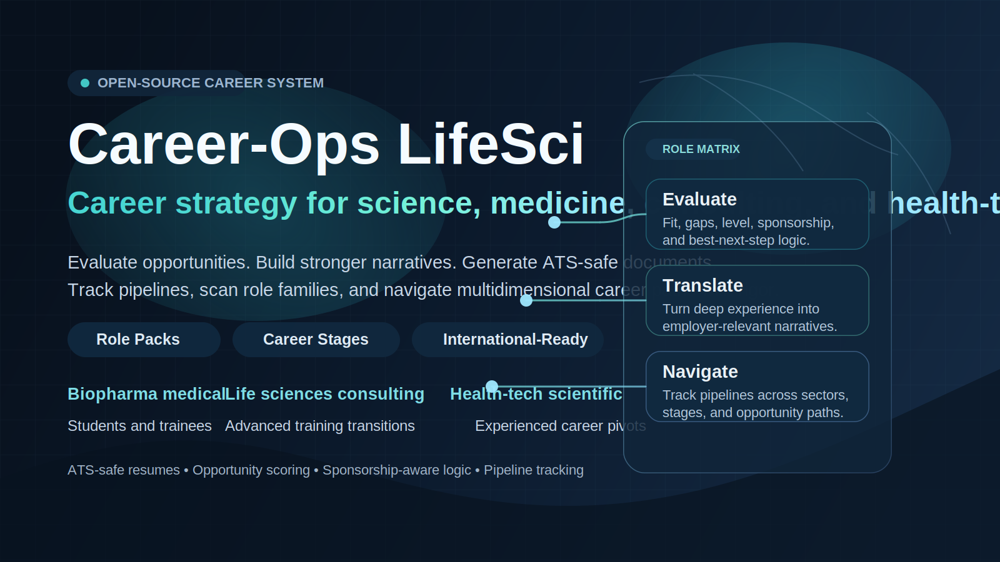

# Career-Ops LifeSci

English-first repository

<p align="center">
  <a href="https://github.com/mosabutey/career-ops-lifesci"></a>
</p>

<p align="center">
  <em>Resumes and spreadsheets are not enough for modern career navigation.</em><br>
  <strong>Career-Ops LifeSci helps ambitious people evaluate, target, position, package, and pursue the right opportunities with rigor.</strong><br>
  <em>Built as a community-first evolution of an excellent open-source foundation.</em>
</p>

<p align="center">
  
  
  
  
  
  
  
</p>

---

<p align="center">
  
</p>

## What This Is

Career-Ops LifeSci is an open-source career operating system for people navigating complex professional paths across science, medicine, consulting, health-tech, technical strategy, and adjacent industries.

It is designed for:
- MDs, PhDs, MD-PhDs, postdocs, residents, fellows, and clinicians
- graduate and undergraduate students
- internship, externship, co-op, and fellowship applicants
- international candidates navigating CPT, OPT, STEM OPT, J-1 pathways, and future sponsorship questions
- career changers with deep but nontraditional experience
- ambitious operators who need more than a resume, spreadsheet, and intuition

Career-Ops LifeSci is not just a resume tool. It helps you:
- evaluate opportunities with structured judgment
- identify fit across multiple role families
- translate your experience into employer-relevant language
- reason clearly about work authorization, sponsorship signals, and international-candidate constraints
- generate tailored, ATS-safe documents
- build opportunity pipelines and track decisions
- move faster without losing rigor

> **Important:** Career-Ops LifeSci is not a spray-and-pray bot. It is a decision-support system. It is designed to help you choose the right opportunities, not overwhelm employers with low-fit applications.

## Why This Exists

Modern career navigation is multidimensional. A strong candidate may simultaneously fit:
- biotech or pharma medical-scientific roles
- life sciences consulting or diligence work
- health-tech strategy or scientific product roles
- internships, fellowships, or other stage-specific entry paths

Most people are told to reduce themselves to one title too early. Career-Ops LifeSci takes the opposite approach: it helps you manage opportunity intelligence, narrative positioning, and application quality across multiple plausible futures.

## Who It Serves First

Day-one audience order:
1. Scientists and clinicians
2. Broader career changers with deep transferable experience
3. Students and trainees entering industry

The repo supports role packs and career-stage paths from the start, so it can serve both an experienced physician-scientist and a graduate student pursuing a first industry internship.

## Role Packs and Career Stages

### Role packs

- `biopharma_medical`: medical affairs, MSL, scientific affairs, clinical scientist, translational science, biomarker, and therapeutic-area roles
- `life_sciences_consulting`: strategy, diligence, advisory, portfolio, and scientifically intensive consulting roles
- `healthtech_scientific`: product, clinical strategy, medical content, partnerships, solutions, and scientific-product roles
- `adjacent_generalist`: cross-functional roles where scientific or clinical credibility creates an edge

### Career stages

- `student_early`: undergraduate, graduate, internship, externship, co-op, trainee
- `advanced_training`: PhD candidate, postdoc, resident, fellow, MD-PhD, research trainee
- `experienced_professional`: clinician, scientist, consultant, operator, manager

## Core Capabilities

| Capability | What it does |
|------------|--------------|
| **Evaluate** | Scores a role, explains fit, gaps, risks, and positioning strategy |
| **Compare** | Ranks multiple roles without flattening important trade-offs |
| **PDF / Resume Generation** | Produces tailored ATS-safe resume variants for each role family |
| **Scan** | Searches portals and company pages for new opportunities |
| **Batch** | Processes multiple opportunities in parallel |
| **Tracker** | Keeps a canonical application pipeline with integrity checks |
| **Interview Prep** | Builds reusable stories, objections, and case-study framing |
| **Contact** | Drafts role-aware outreach for networking and recruiter conversations |

## Quick Start

```bash
# 1. Clone and install
git clone https://github.com/mosabutey/career-ops-lifesci.git
cd career-ops-lifesci
npm install
npx playwright install chromium

# 2. Configure your profile
cp config/profile.example.yml config/profile.yml
cp templates/portals.example.yml portals.yml

# 3. Add your source material
# Create cv.md in the project root
# Optional: create article-digest.md with proof points, publications, projects, awards

# 4. Open your AI coding tool in this directory
claude

# 5. Ask it to personalize the system
# "Set this up for biotech medical affairs and life sciences consulting roles"
# "Build a student internship version for me"
# "Tailor the scanner to neuro, oncology, and health-tech companies"
```

See [docs/SETUP.md](docs/SETUP.md) for the full setup guide.

## Typical Workflows

### Opportunity evaluation

Paste a job URL or JD text and get:
- a structured evaluation report
- a score with clear reasoning
- a recommended resume variant
- a tracker entry

### Role-family adaptation

Ask the agent to adapt the repo to your path:
- "Change the role packs to medtech commercialization and VC diligence"
- "Support consulting internships and PhD fellowship applications"
- "Make my default path medical affairs, with health-tech as secondary"

### Stage-aware support

Career-Ops LifeSci explicitly supports:
- internships
- externships
- co-ops
- fellowships
- early-career associate roles
- advanced training transitions
- experienced professional pivots

### International candidate support

The repo can be configured for candidates who:
- can work now but will need sponsorship later
- need immediate sponsorship or transfer support
- are pursuing internships or early-career roles through CPT, OPT, STEM OPT, J-1, or similar pathways

The default policy is practical:
- explicit no-sponsorship language is a real signal
- explicit sponsorship support is a positive signal
- silence is not an automatic rejection
- citizenship or clearance requirements should be surfaced clearly

## How It Works

```text
You provide a JD or URL
        |
        v
Role-pack detection + career-stage detection
        |
        v
Structured evaluation
        |
        +--> report (.md)
        +--> tailored resume (.pdf)
        +--> tracker TSV -> applications.md
```

## Examples

Check the `examples/` directory for fictional setups covering multiple user types, including:
- physician-scientist to medical affairs
- graduate student to consulting internship
- broader dual-track profiles

## Public-Facing Principles

- Quality over quantity
- Honest evidence over inflated narratives
- Local-first data handling
- Human review before any application is sent
- Broad usefulness beyond one founder or one career arc

## Acknowledgment

This repo is a community-first evolution of the original [career-ops](https://github.com/santifer/career-ops) by [santifer](https://santifer.io), whose work demonstrated how powerful local-first, agentic job-search tooling can be.

This fork expands that foundation toward scientific, clinical, consulting, health-tech, student, and multidomain career navigation.

The portfolio that accompanied the original project is also open source: [cv-santiago](https://github.com/santifer/cv-santiago).

## Project Structure

```text
career-ops-lifesci/
|-- AGENTS.md
|-- CLAUDE.md
|-- config/profile.example.yml
|-- modes/
|-- templates/
|-- batch/
|-- dashboard/
|-- docs/
|-- examples/
|-- data/
|-- reports/
|-- output/
```

## Documentation

- [docs/SETUP.md](docs/SETUP.md)
- [docs/CUSTOMIZATION.md](docs/CUSTOMIZATION.md)
- [docs/ARCHITECTURE.md](docs/ARCHITECTURE.md)
- [CONTRIBUTING.md](CONTRIBUTING.md)
- [LEGAL_DISCLAIMER.md](LEGAL_DISCLAIMER.md)

## Disclaimer

Career-Ops LifeSci is a local, open-source tool, not a hosted service. You control your data, your prompts, your providers, and your outputs. Always review generated material for accuracy and fit before using it in the real world.

See [LEGAL_DISCLAIMER.md](LEGAL_DISCLAIMER.md) for full details.

## License

Released under the [MIT License](LICENSE).
